# Modular Multi-Organ Cancer Classification System

A modular deep-learning system for medical image classification that first validates and routes an input image to the appropriate medical-domain expert, then performs domain-specific classification and generates a Grad-CAM visualization for interpretability.

> **Disclaimer:** This project is an educational/research prototype and is **not a clinically validated medical diagnostic system**. It must not be used for medical diagnosis or treatment decisions.

---

## Project Overview

Medical images from different organs and imaging domains can have substantially different visual characteristics. Instead of training a single classifier to directly handle every domain, this project uses a **modular router–expert architecture**.

The system first determines which supported domain the input belongs to and then forwards the image to a specialized expert model trained for that domain.

The current system supports:

* **Brain MRI**
* **Kidney CT**
* **Oral Histopathology**

The system contains:

* One **Router Model**
* One **Brain Expert Model**
* One **Kidney Expert Model**
* One **Oral Expert Model**
* Input validation
* Confidence-based rejection
* Grad-CAM visualization

---

## System Architecture

### High-Level Pipeline

<p align="center">
  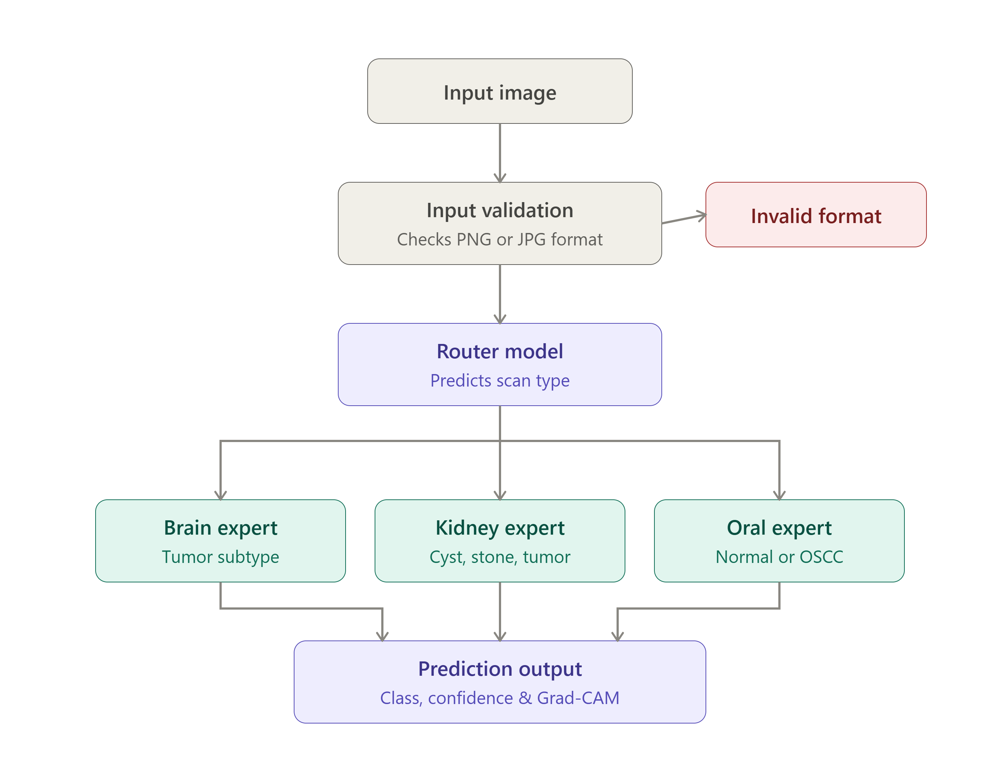
</p>


### Main Components

### 1. Input Validation

Before inference begins, the input validation module checks whether the supplied file is an accepted image format.

The current inference pipeline accepts:

* `.png`
* `.jpg`
  
Invalid files are rejected before they reach the model.

### 2. Preprocessing

Valid images are:

1. Converted to RGB
2. Resized to `224 × 224`
3. Converted to tensors
4. Normalized using the same normalization used during model inference

```python
transforms.Normalize(
    mean=[0.485, 0.456, 0.406],
    std=[0.229, 0.224, 0.225]
)
```

### 3. Router Model

The router determines the domain of the input image.

Its output categories are:

```text
brain
kidney
oral
random
```

The `random` category represents images outside the supported medical domains.

### 4. Expert Model

Once the router selects a domain, the image is forwarded to the corresponding specialist model:

```text
brain  → Brain Expert
kidney → Kidney Expert
oral   → Oral Expert
```

### 5. Confidence Check

After the expert prediction, the highest softmax probability is used as the confidence value for this prototype.

If the confidence is below `0.50`, the system reports:

```text
Model has low confidence - recommended manual review.
```

and does not return a final classification.

### 6. Grad-CAM

After a prediction is produced, Grad-CAM is used to generate a heatmap showing image regions associated with the selected expert's prediction.

---

# Training Environment & Compute

The models were trained using **Kaggle Notebooks** with an NVIDIA **Tesla T4 GPU**.

### Training Configuration

| Component        | Configuration    |
| ---------------- | ---------------- |
| Platform         | Kaggle Notebooks |
| GPU              | NVIDIA Tesla T4  |
| Framework        | PyTorch          |
| Batch Size       | **64**           |
| Input Resolution | **224 × 224**    |

A batch size of **64** was used during training. Increasing the batch size further resulted in **out-of-memory (OOM)** errors on the available GPU memory, so 64 was used as the practical batch-size limit for the training setup.

The models were trained using the same general training pipeline, with the final classification layer adapted to the number of classes for each task.


# Router Model

## Purpose

The router is the first machine-learning component in the pipeline. Its job is not to determine the disease itself. Instead, it determines **which specialized expert should process the image**.

The router was implemented using **DenseNet121** with a four-class output layer.

### Router Classes

| Class    | Meaning                             |
| -------- | ----------------------------------- |
| `brain`  | Brain MRI image                     |
| `kidney` | Kidney CT image                     |
| `oral`   | Oral histopathology image           |
| `random` | Image outside the supported domains |

### Routing Logic

```text
Input Image
     │
     ▼
  Router
     │
     ├── brain  ──→ Brain Expert
     ├── kidney ──→ Kidney Expert
     ├── oral   ──→ Oral Expert
     └── random ──→ Reject / Unsupported Domain
```

### Router Dataset Construction

The router dataset was constructed by organizing images into domain-level categories rather than disease-level categories:

| Router Class | Source Domain                                |
| ------------ | -------------------------------------------- |
| `brain`      | Brain MRI                                    |
| `kidney`     | Kidney CT                                    |
| `oral`       | Oral histopathology                          |
| `random`     | Images outside the supported medical domains |

The resulting dataset allows the router to learn the distinction between the three supported medical domains and an additional out-of-domain category.

The router therefore performs **domain classification**, while the expert models perform the actual disease/class classification.

```text
Brain MRI          ──┐
                     │
Kidney CT           ──┼──→ Router Dataset
                     │
Oral Histopathology ─┤
                     │
Out-of-domain       ─┘
                            ↓
                    Router Training
                            ↓
                  brain / kidney / oral / random
```

> **Dataset note:** The `random` class is intended to represent images outside the supported domains. Its performance should therefore be interpreted in the context of the images selected for this category.

If the router predicts `random`, the inference script informs the user that the current system only processes brain, kidney, and oral images.

If the router confidence is too low, the system reports the prediction as unreliable rather than continuing blindly.

## Router Results

The router was evaluated on **320 samples**, with 80 samples per router category.

| Class                | Precision | Recall | F1-score | Support |
| -------------------- | --------: | -----: | -------: | ------: |
| Brain                |      1.00 |   1.00 |     1.00 |      80 |
| Kidney               |      1.00 |   1.00 |     1.00 |      80 |
| Oral                 |      1.00 |   1.00 |     1.00 |      80 |
| Random               |      1.00 |   1.00 |     1.00 |      80 |
| **Overall Accuracy** |           |        | **1.00** | **320** |

The router achieved **100% accuracy and 100% macro F1** on this evaluation set.

### Router Confusion Matrix

<p align="center">
  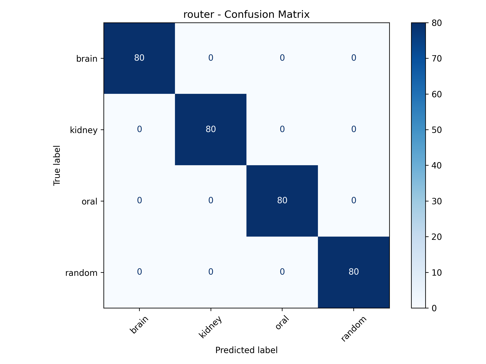
</p>

The confusion matrix shows the predictions across the four routing categories.

---

# Brain Expert

## Purpose

The Brain Expert receives images routed to the brain domain and performs four-class classification.

### Classes

```text
Glioma
Meningioma
No Tumor
Pituitary
```

### Model

**DenseNet121**

The final DenseNet classifier was adapted to output four classes.

---

## Brain Expert Results

The Brain Expert achieved:

* **Accuracy:** 97.14%
* **Macro F1:** 97.17%
* **Weighted F1:** 97.13%

### Classification Report

| Class         |   Precision |      Recall |    F1-score |  Support |
| ------------- | ----------: | ----------: | ----------: | -------: |
| Glioma        |      98.21% |      94.30% |      96.22% |      755 |
| Meningioma    |      95.76% |      95.24% |      95.50% |      546 |
| No Tumor      |      96.06% |     100.00% |      97.99% |      487 |
| Pituitary     |      97.97% |     100.00% |      98.97% |      626 |
| **Macro Avg** | **96.998%** | **97.386%** | **97.169%** | **2414** |

### Confusion Matrix

<p align="center">
  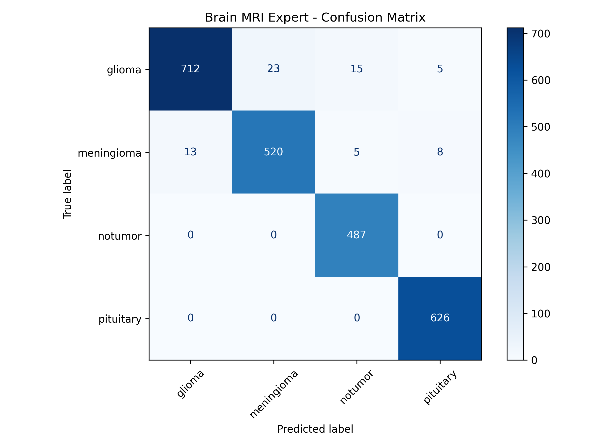
</p>


### Grad-CAM Examples

<table>
  <tr>
    <th>Original Image</th>
    <th>Grad-CAM Overlay</th>
  </tr>
  <tr>
    <td align="center">
      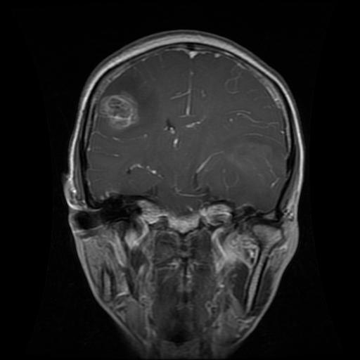
    </td>
    <td align="center">
      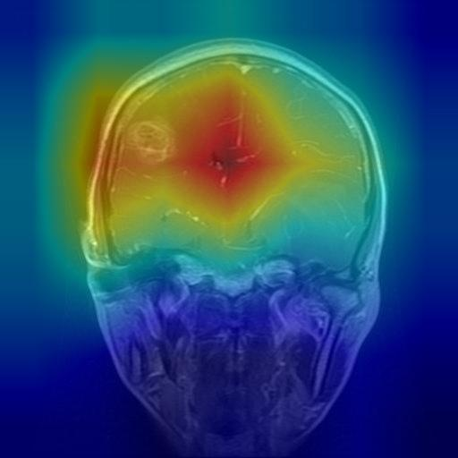
    </td>
  </tr>
</table>

# Kidney Expert

## Purpose

The Kidney Expert receives kidney CT images from the router and performs four-class classification.

### Classes

```text
Cyst
Normal
Stone
Tumor
```

### Model

**DenseNet121**

---

## Kidney Expert Results

The Kidney Expert achieved:

* **Accuracy:** 97.28%
* **Macro F1:** 96.32%
* **Weighted F1:** 97.26%

### Classification Report

| Class         |  Precision |     Recall |   F1-score |  Support |
| ------------- | ---------: | ---------: | ---------: | -------: |
| Cyst          |     94.87% |     99.46% |     97.11% |      372 |
| Normal        |     99.02% |     99.21% |     99.12% |      509 |
| Stone         |     96.90% |     89.93% |     93.28% |      139 |
| Tumor         |     97.73% |     93.89% |     95.77% |      229 |
| **Macro Avg** | **97.13%** | **95.62%** | **96.32%** | **1249** |

### Confusion Matrix

<p align="center">
  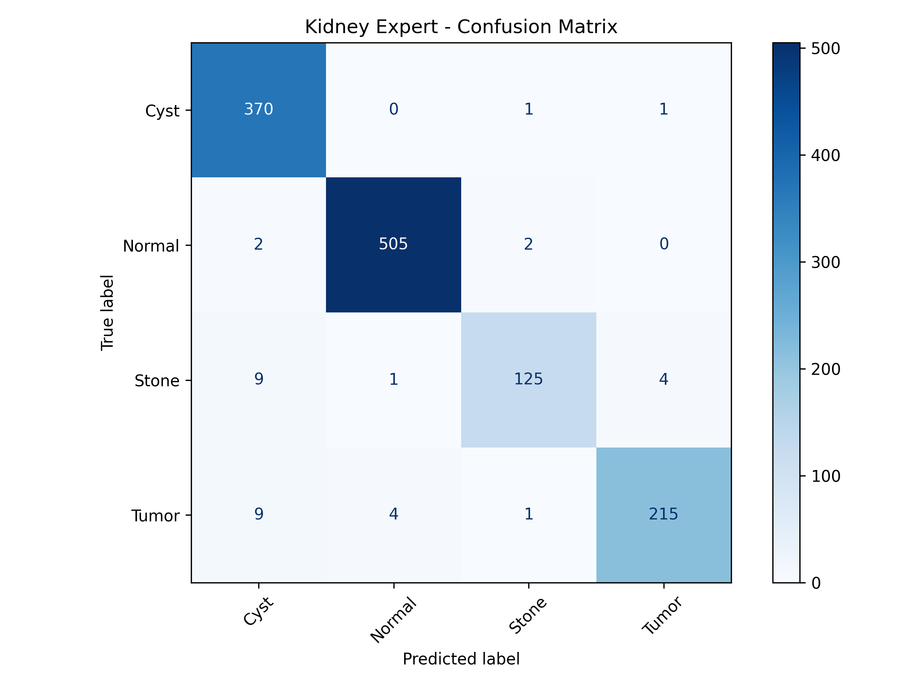
</p>


### Grad-CAM Examples

<table>
  <tr>
    <th>Original Image</th>
    <th>Grad-CAM Overlay</th>
  </tr>
  <tr>
    <td align="center">
      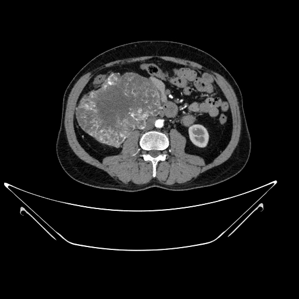
    </td>
    <td align="center">
      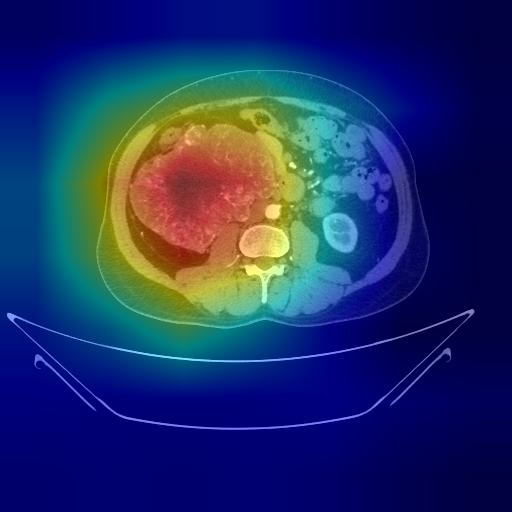
    </td>
  </tr>
</table>

# Oral Expert

## Purpose

The Oral Expert receives oral histopathology images and performs binary classification.

### Classes

```text
Normal
OSCC
```

where **OSCC** refers to oral squamous cell carcinoma in the dataset.

### Model

**DenseNet121**

---

## Oral Expert Results

The Oral Expert achieved:

* **Accuracy:** 87.30%
* **Macro F1:** 83.24%
* **Weighted F1:** 87.43%

### Classification Report

| Class         |  Precision |     Recall |   F1-score | Support |
| ------------- | ---------: | ---------: | ---------: | ------: |
| Normal        |     72.73% |     77.42% |     75.00% |      31 |
| OSCC          |     92.47% |     90.53% |     91.49% |      95 |
| **Macro Avg** | **82.60%** | **83.97%** | **83.24%** | **126** |

### Confusion Matrix

<p align="center">
  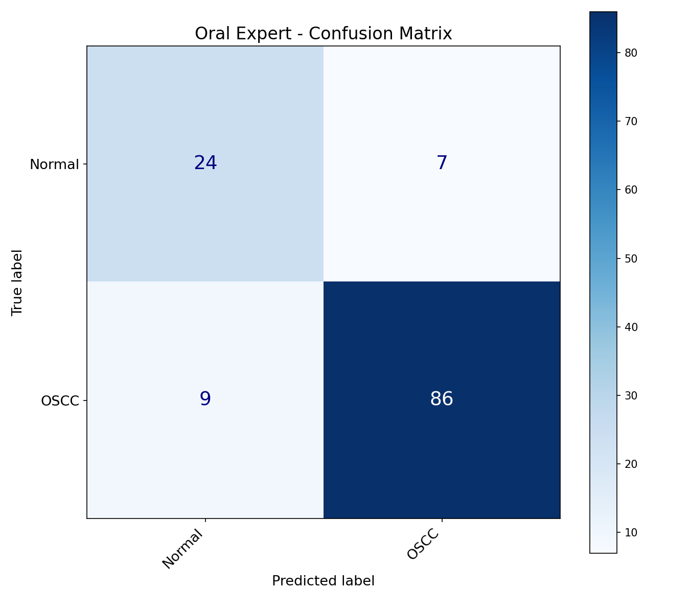
</p>

The oral expert has lower performance than the brain and kidney experts. In particular, the Normal class has a lower F1-score than OSCC.

### Grad-CAM Examples

<table> 
  <tr> 
    <th>Original Image</th> 
    <th>Grad-CAM Overlay</th> 
  </tr> 
  <tr> 
    <td align="center"> 
      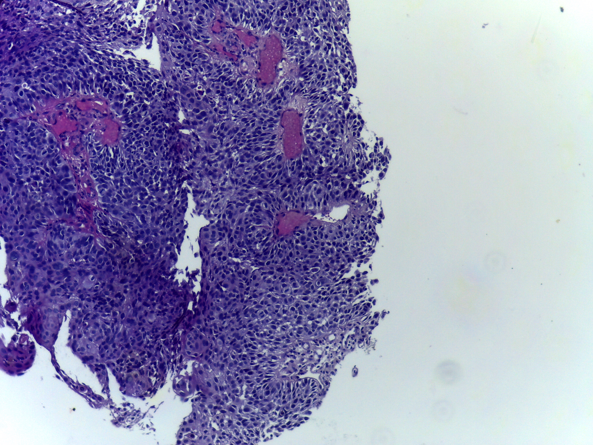 
    </td> 
    <td align="center"> 
      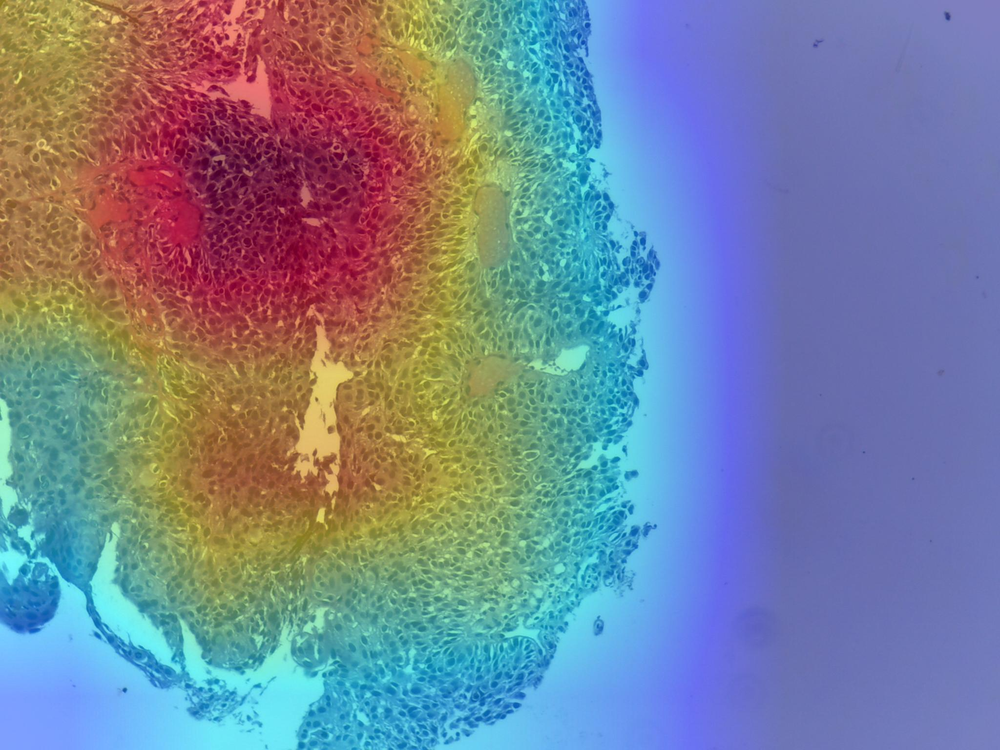 
    </td> 
  </tr> 
</table>

# Results Summary

The following table summarizes the performance of each component.

| Component     | Task                               |    Accuracy |    Macro F1 |
| ------------- | ---------------------------------- | ----------: | ----------: |
| Router        | 4-domain routing                   | **100.00%** | **100.00%** |
| Brain Expert  | Brain MRI classification           |  **97.14%** |  **97.17%** |
| Kidney Expert | Kidney CT classification           |  **97.28%** |  **96.32%** |
| Oral Expert   | Oral histopathology classification |  **87.30%** |  **83.24%** |

The values are taken from the corresponding classification reports.

---

# Inference Pipeline

The complete inference pipeline is implemented in the inference script.

### Step 1 — Input Validation

The system first checks whether the input file is an accepted image format.

### Step 2 — Preprocessing

The image is:

```text
RGB conversion
      ↓
224 × 224 resize
      ↓
Tensor conversion
      ↓
Normalization
```

### Step 3 — Router Prediction

The router receives the processed image and predicts one of:

```text
brain
kidney
oral
random
```

### Step 4 — Router Confidence Check

If the router's prediction confidence is below the configured threshold, the system reports:

```text
Model has low confidence - recommended manual review
```

and stops the prediction pipeline.

### Step 5 — Unsupported Domain Handling

If the router predicts `random`, the system reports that the model currently supports only:

```text
Brain
Kidney
Oral
```

and does not send the image to an expert model.

### Step 6 — Expert Model

If the router selects a supported domain, the corresponding expert model receives the same processed image.

### Step 7 — Expert Prediction

The expert outputs class logits, which are converted to softmax probabilities.

The system reports:

* Final predicted class
* Confidence per class
* Highest-confidence prediction

### Step 8 — Grad-CAM

The selected expert is then used to generate a Grad-CAM visualization.

### Example Inference Flow

```text
Input Image
    ↓
Input Validation
    ↓
Preprocessing
    ↓
Router
    ↓
Confidence Check
    ↓
Domain Selection
    ↓
Expert Model
    ↓
Class Probabilities
    ↓
Grad-CAM
    ↓
Final Output
```
### Inference Output

```text

Router says: kidney
Final prediction: tumor
Confidence per class:
  cyst: 0.38%
  normal: 1.04%
  stone: 0.56%
  tumor: 98.02%
Saved: kidney_gradcam.jpg

```
---

# Explainability with Grad-CAM

Grad-CAM is used to visualize regions associated with the model's activation for the selected prediction.

The visualization pipeline is:

```text
Input Image
     ↓
Selected Expert
     ↓
Target Convolutional Features
     ↓
Grad-CAM Heatmap
     ↓
Overlay on Original Image
```

The goal is to provide an additional visual interpretation of the model's prediction rather than returning only a class label.

> **Important:** Grad-CAM is an interpretability visualization. It does not prove that the highlighted region is medically causal or that the prediction is clinically correct.
---

# External Image Testing & Generalization

During qualitative testing, an important behavior was observed.

The expert models performed well on their respective held-out validation/test data, but some models—particularly the **kidney and oral experts**—did not consistently produce good predictions on externally sourced internet images.

The brain expert showed better behavior on some external examples.

This does **not** invalidate the held-out test results. Instead, it highlights a distinction between:

```text
Performance on the dataset distribution
                vs.
Performance on external / unseen domains
```

## Out-of-Distribution & Domain Gap

A possible explanation is **out-of-distribution (OOD) / domain-shift behavior**.

The held-out test images come from the same underlying dataset distribution used to train the corresponding expert. Internet images may differ in:

* Image acquisition source
* Scanner/camera characteristics
* Resolution
* Cropping
* Contrast and intensity distribution
* Histopathology staining characteristics
* Preprocessing
* Image composition
* Patient/population characteristics

Therefore, strong performance on a held-out test split does not automatically guarantee strong performance on arbitrary images obtained from the internet.

### How This Was Treated

The reported metrics in this README are based on the respective held-out evaluation sets.

External internet images were used only as **qualitative experiments** and are not included in the reported accuracy, precision, recall, or F1-score.

This distinction is important when interpreting the results.

---

# Limitations

### 1. Dataset Dependence

Each expert is specialized for a particular dataset and imaging domain. Good performance on one dataset does not guarantee equivalent performance on another source.

### 2. External Generalization

The external-image experiments revealed weaker generalization for some expert models, especially the kidney and oral models.

### 3. Oral Expert Performance

The oral expert is the weakest-performing component in the current system, achieving a macro F1-score of 83.24%. The Normal class performs notably worse than the OSCC class.

### 4. No Clinical Validation

The models have not undergone clinical validation, prospective evaluation, regulatory validation, or deployment testing.

### 5. Grad-CAM Limitations

Grad-CAM provides an interpretation-oriented visualization but does not guarantee that the highlighted regions correspond to clinically meaningful causal evidence.

---

# Project Structure

```text
modular-multi-organ-cancer/
├── model_weights/
│   ├── brain_expert_model.pth
│   ├── kidney_expert_model.pth
│   ├── oral_expert_model.pth
│   └── router_expert_model.pth
│
├── models/
│   ├── brain_model.py
│   ├── kidney_model.py
│   ├── oral_model.py
│   └── router_model.py
│
├── assets/
│   ├── architecture.png
│   ├── router_confusion_matrix.png
│   ├── brain_confusion_matrix.png
│   ├── kidney_confusion_matrix.png
│   ├── oral_confusion_matrix.png
│   └── gradcam/
│        ├── glioma_brain_gradcam.jpg
│        ├── glioma_brain_image.jpg
│        ├── kidney_tumor_gradcam.jpg
│        ├── kidney_tumor_image.jpg
│        ├── oral_OSCC_gradcam.jpg
│        └── oral_OSCC_image.jpg
│
│
├── inference.py
├── README.md
├── grad_cam.py
├── input_validation.py
├── models_paths.py
├── requirements.txt
└── router_dataset.py

```

---

# Installation

## Clone the repository

```bash
git clone https://github.com/deviprasadbrl/Modular-Multi-Organ-Cancer-Classification-System
cd Modular-Multi-Organ-Cancer-Classification-System
```

## Install dependencies

```bash
pip install -r requirements.txt
```
---

# Model Weights

The trained model checkpoints are included with the project.

model_weights/
├── brain_expert_model.pth
├── kidney_expert_model.pth
├── oral_expert_model.pth
└── router_expert_model.pth

Each model checkpoint is approximately 27 MB.

The inference script loads the corresponding checkpoint from the paths defined in models_paths.py.

# Running Inference

After placing the trained weights in the expected location, update the paths in the model-path configuration.

Then run:

```bash
python inference.py
```

The pipeline will:

1. Validate the input image
2. Preprocess the image
3. Run the router
4. Check router confidence
5. Reject unsupported/random inputs
6. Select the appropriate expert
7. Generate the final classification
8. Display class probabilities
9. Generate a Grad-CAM visualization

# AI Assistance

AI tools were used during the development of this project as a supporting resource for:

* Documentation and README organization
* Debugging and clarification of implementation issues
* Brainstorming and improving project presentation

The model architecture, training, evaluation, inference pipeline, and experimentation were implemented and tested by the author.

# Future Improvements

Potential future improvements include:

* Improved external-domain generalization
* More diverse datasets
* Stronger out-of-distribution detection
* Better calibration of confidence scores
* Improved oral expert performance
* More robust router evaluation
* Larger external validation sets
* Better deployment optimization
* Additional medical imaging domains

---

# What I Learned

This project provided practical experience with:

* Transfer learning
* DenseNet121
* Multi-model architectures
* Modular routing systems
* Medical image classification
* Dataset inspection and quality problems
* Train/validation/test evaluation
* Classification reports
* Confusion matrices
* Grad-CAM
* Model inference pipelines
* Out-of-distribution/domain-shift behavior
* Building and organizing a complete deep-learning project

One of the most important lessons from the project was that strong performance on a held-out dataset does not necessarily imply robust behavior on data from a different distribution.

---

# Conclusion

This project demonstrates a modular approach to medical image classification in which a routing model identifies the input domain and forwards the image to a specialized expert model.

The current implementation demonstrates strong held-out performance for the router, brain expert, and kidney expert, while the oral expert provides a useful example of how performance can vary across datasets and classes.
The project is intended as an **educational and research prototype**, with future work focused on improving robustness, external generalization, and evaluation across broader data distributions.

---

# References

**Datasets Used**

* Brain MRI dataset: https://data.mendeley.com/datasets/zwr4ntf94j/1
* Kidney CT dataset: https://www.kaggle.com/datasets/srinivasbece/kindey-stone-dataset-splitted
* Oral histopathology dataset: https://www.kaggle.com/datasets/ashenafifasilkebede/dataset


---

# Author

**Devi Prasad BRL**

[GitHub](https://github.com/deviprasadbrl)

---
